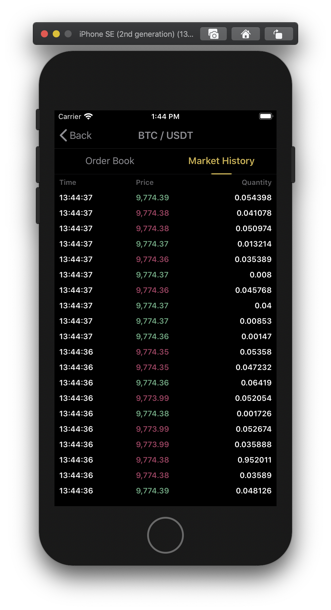

# crypto-book

## Overview

| Main Menu | Order Book | Market History |
|---|---|---|
|  |  |  |

| Order Book | Order Book Stress Test | Market History | Market History Stress Test |
|---|---|---|---|
|  |  |  |  |

| Component: Page Controller | Component: Loading View | Component: Selector View |
|---|---|---|
|  |  |  |

## Requirements
* Xcode 11.5
* iOS 13+

## Xcode configuration
* Page guide column at 120
* Tab With: 4 spaces
* Indent Width: 4 spaces

## Tech Stack
* Architecture `MVVM`. Using services for commong implementations. The addition of a `Coordinator` was not really needed for this sample but would be consider if the number of screens increases.
* All view models & services uses dependency injection to allow creation of mocks in allow better testability. 
* No 3rd party libraries.
* FRP with Combine.

## Tests
There are two different targets of test, `unit-tests` for mocked and non-network dependant tests, and `integration-tests` that performs network requests to verify the API endpoints.
