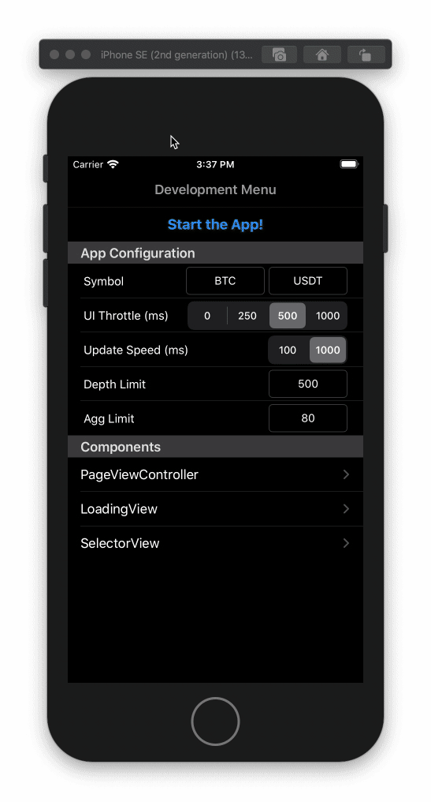

# crypto-book

## Overview

| Developer Menu | Order Book (Dark) |  Market History (Dark) | Order Book (Light) | Market History (Light) |
|---|---|---|---|---|
|  |  |  |  |  |

| Order Book BTCUSDT | Order Book BNBUSDT | Market History BTCUSDT | Market History BNBUSDT |
|---|---|---|---|
|  |  |  |  |
| `UI Throttle` 500ms, `Update spped` 1000ms | `UI Throttle` 250ms, `Update spped` 100ms | `UI Throttle` 500ms, `Update spped` 1000ms | `UI Throttle` 250ms, `Update spped` 100ms |

| Order Book Stress Test | Market History Stress Test | Data recovery when going offline |
|---|---|---|
|  |  |  |
| `UI Throttle` 0ms, `Update spped` 100ms | `UI Throttle` 0ms, `Update spped` 100ms | `UI Throttle` 250ms, `Update spped` 100ms |

| Component: Page Controller | Component: Loading View | Component: Selector View |
|---|---|---|
|  |  |  |

## Requirements
* Xcode 11.5
* iOS 13+

## Tech Stack
* Architecture `MVVM`. Using `Services` for common implementations. The addition of a `Coordinator` was not really needed for this sample but would be consider if the number of screens increases.
* All `ViewModels` & `Services` use dependency injection to allow creation of mocks and make it more testable. 
* No 3rd party libraries (just a helper class for `Reachability`).
* FRP with `Combine`.
* WebSockets with `URLSessionWebSocketTask`.

## Tests
There are two different targets of test, `unit-tests` for mocked and non-network dependant tests, and `integration-tests` that performs network requests to verify the API endpoints.
